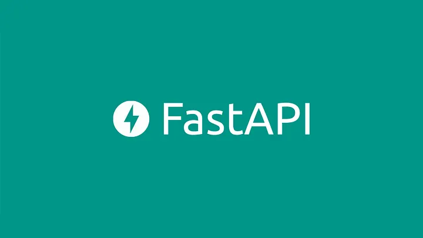

# FastAPI Blog

>#### This app contains 2 main routes, *User* and *Blog*
>> User Router has login, register routes.\
>> Blog Router contains createBlog, deleteBlog, updateBlog and getBlog.

This app uses **pydantic** models for *data validations*, **typing** for *type hints* and *annotations*, **sqlalchemy** for *object relationship mapper*,  **python-jose** for *jwt-token handling*, **sqlite3** for *database managment* and **python-bcrypt** for *password hashing and rehashing*.

